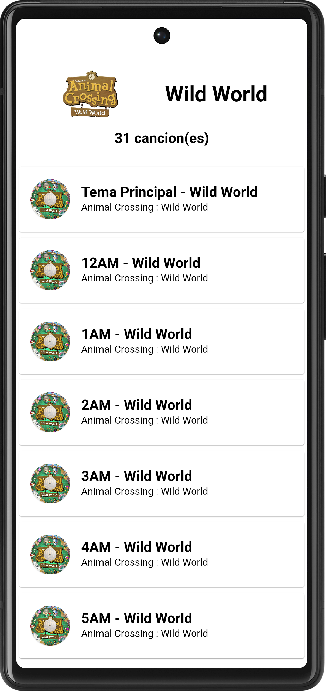

 


# Animal Crossing Radio
Aplicación de música basada en Animal Crossing completamente offline!

# Compatibilidad
- [x] android
- [x] iOS

# Dependencias
En el estado actual del proyecto, las dependencias usadas son las siguientes
```
  cupertino_icons: ^1.0.2
  flutter_launcher_icons: ^0.11.0
  audioplayers: ^3.0.1
  sqflite: ^2.2.4+1
  stacked: ^3.2.0
  stacked_services: ^1.0.0
  download_assets: ^3.0.3
  dio: ^4.0.6
  path_provider: ^2.0.14
```

# Capturas de pantalla

## Pantalla de Login
Pantalla inicial donde el usuario puede iniciar sesión o crear una cuenta
(NOTA: Ten en cuenta que esto creará un perfil privado donde guardar tus datos)


<br/>

## Pantalla de Carga
Pantalla que muestra al usuario recomendaciones cada vez que inicia sesión en la app


## Pantalla de Titulo
Pantalla donde se mostrará la información relativa a novedades en la aplicación,
licencias y detalles internos de la app


<br/>

## Creación del personaje
Pantalla donde a través de un asistente, Tom Nook, se crea un perfil de usuario, proporcionando nombre de usuario,
sexo y fecha de nacimiento


<br/>

## Pantalla de Inicio
Pantalla principal donde el usuario podrá acceder a todos los contenidos de la misma


<br/>

## AppBar
En el appBar se pueden acceder a los siguientes menus :

### Perfil de usuario
Una pantalla donde se puede acceder, entre otros, a datos del usuario,
pasaporte, datos de la app, etc.


<br/>

### Bolsillo
En esta pantalla se puede acceder al bolsillo del usuario en ese momento
Pueden interactuar con tus objetos obtenidos, entre otros


<br/>


## Menu Central
En el menú central se ofrecen las opciones principales de la aplicación, entre ellas :

### Discos
Accede a un repertorio seleccionado de las canciones más icónicas de la saga, agrupadas por cada título.
Selecciona un disco, cargalo, elige una canción y dale al play!




<br/>


### Conciertos
A partir de las 20:00, podrás disfrutar de una canción Aleatoria de Totakeke.


<br/>

### Tienda
Lugar donde podrás adquirir canciones que falten en tu colección


<br/>

### Jardín
Lugar donde podrás recolectar todo tipo de objetos con los que obtener dinero.
(Se proveerá más información de esta función en el futuro)


